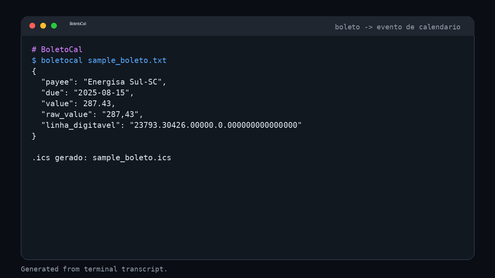

<!-- AGENT-FIRST NOTICE -->
> [!IMPORTANT]
> ### 🤖 Leia isto com seu agente de IA — não leia à mão.
> Este repositório é escrito agent-first. Aponte Claude Code, GitHub Copilot, Cursor ou qualquer agente para ele:
> *"Leia o README e o AGENTS.md, depois instale e use esta skill."*
<!-- /AGENT-FIRST NOTICE -->

<div align="center">

# 💸 BoletoCal

### Transforme qualquer boleto brasileiro em um evento de calendário — vencimento + valor + lembrete automático.

[](LICENSE)
[](https://python.org)
[](#testes)

</div>

## O problema

No Brasil, boleto vence e gera juros/tarifas se esquecido. A maioria dos bots de boleto só *notifica*; **nenhum** (gap real: `0` repos em "boleto to calendar") vira o boleto em um **evento de calendário com lembrete**. O BoletoCal faz exatamente isso: a partir de um boleto em texto (ou linha digitável), extrai **vencimento, valor e beneficiário** e gera um `.ics` pronto pra importar no Google Agenda, Apple Calendar ou Outlook.

> Ângulo 10x: entra boleto (texto/PDF/WhatsApp) → sai evento de calendário. Zero config. Amigável a automações via WhatsApp.

## Instalação

```bash
git clone https://github.com/matheus24scc/BoletoCal.git
cd BoletoCal
pip install -e .
```

## Uso

### CLI

```bash
boletocal sample_boleto.txt
# -> imprime JSON extraído e gera sample_boleto.ics
```

### Como biblioteca

```python
from boletocal.parser import extract
from boletocal.calendar import to_ics

data = extract(open("sample_boleto.txt", encoding="utf-8").read())
ics = to_ics(data)          # evento + VALARM 2 dias antes
```

### Exemplo de entrada (`sample_boleto.txt`)

```
Beneficiario: Energisa Sul-SC
Vencimento: 15/08/2025
Valor: R$ 287,43
Linha digitavel: 23793.30426.00000.0.000000000000000
```

Saída: evento `Boleto: Energisa Sul-SC R$ 287,43` em 15/08/2025, com alarme 2 dias antes.

## Como funciona

- `boletocal/parser.py` — regex tolerante extrai vencimento (`dd/mm/aaaa`), valor (`R$ x,xx`) e linha digitável.
- `boletocal/calendar.py` — gera VCALENDAR/VEVENT válido com `VALARM` de lembrete.
- `boletocal/cli.py` — interface de linha de comando (argparse).


## Demo



> GIF animado: [boletocal-demo.gif](assets/boletocal-demo/boletocal-demo.gif) — execucao real do CLI.

## Testes

```bash
pytest -q
```

Oracle verde (5 testes): extração de vencimento, valor, beneficiário, linha digitável e geração de `.ics`.

## Roadmap

- [ ] Entrada via PDF (pdfplumber) e imagem (OCR)
- [ ] Modo servidor MCP (expõe extração como tool)
- [ ] Integração direta com WhatsApp (encaminhar boleto → evento)

## Licença

MIT — veja [LICENSE](LICENSE).

## Status (checkup 2026-08-18)
> Revisado na campanha de repo-checkup. Relatorio completo: `~/repo-checkup/reports/BoletoCal.md` (local do mantenedor, nao no repo).
- **Build/Install**: PASS — `pip install -e ".[dev]"` RC=0 (pacote `boletocal` instalado em modo editavel + `pytest`).
- **Smoke test**: `python -m pytest -q` -> 5 passed (RC=0); `pip-audit` => "No known vulnerabilities found".
- **Para rodar de ponta-a-ponta precisa de**: nenhum servico externo (pacote CLI/biblioteca Python).
- **Inconsistencias conhecidas (README vs codigo)**: `pyproject.toml` nao declarava o extra `dev` (com `pytest`); corrigido no checkup (agora `pip install -e ".[dev]"` funciona).
- **Seguranca**: `pip-audit` => "No known vulnerabilities found"; secret scan sem segredos reais no codigo-fonte. Sem vulns altas remediadas automaticamente.
- **Estado resumido**: build verde + smoke (install ok, 5 testes passando, sem vulns conhecidas).
